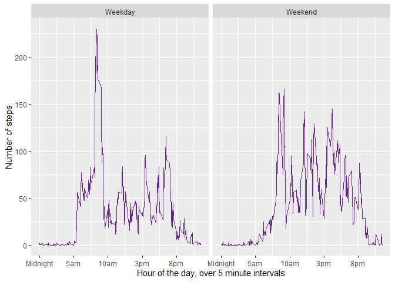

## **Assignment question 1: Loading and preprocessing the data**

### We require the use of various packages for some of the functions, so we load those libraries. Then we preprocess the data by first reading in the file, then making a newinterval column so it represents the total number of minutes since midnight (essentially military time), and creating a concatenated datetime column that has the date and time of each observation. The original file can be found here, but we downloaded and processed it locally for convenience's sake:

### https://github.com/rdpeng/RepData_PeerAssessment1/blob/master/activity.zip


```r
library(stringr)
library(dplyr)
library(lubridate)
library(ggplot2)
totalData <- read.csv("activity.csv")
#Original data had interval values like '50' and '1430' which would mean the 
#number of minutes since midnight, essentially military time. So I add leading
#and trailing zeros to make it a valid time.
totalData$newinterval <- str_pad(totalData$interval, 4, "left", pad = "0")
totalData$newinterval <- str_pad(totalData$newinterval, 6, "right", pad = "0")
#Add colons every two characters.
totalData$newinterval <- gsub("(\\d\\d)(\\d\\d)(\\d\\d)", "\\1:\\2:\\3", totalData$newinterval)
#Create a new column which concatenates the date and interval fields, and puts
#them in a date and time format.
totalData$datetime <- paste(totalData$date, totalData$newinterval, sep = " ")
totalData$datetime <- ymd_hms(totalData$datetime)
```

***

***

## Assignment question 2: What is mean total number of steps taken per day?

### **Part 1:**
> Make a histogram of the total number of steps taken each day

### The assignment asks for a histogram. However, it seems like a histogram isn't really the proper plot for what the assignment is asking for. Here's a histogram of the total number of steps taken each day:


```r
totalStepsByDate <- aggregate(steps ~ day(datetime), totalData, sum)
#Since I haven't yet figured out how to not change the name of the datetime 
#column when using aggregate, I'll just rename the column back.
names(totalStepsByDate)[names(totalStepsByDate) == "day(datetime)"] <- "datetime"
hist(totalStepsByDate$steps,
     xlab = "Number of steps", 
     ylab = "Frequency of that number of steps",
     main = "Distribution of Steps", 
     col = "orange")
```

<!-- -->

### It seems like a barplot would be a more appropriate plot for what the assignment is really asking for:


```r
barplot(steps ~ datetime, totalStepsByDate,
        xlab = "Day of the month",
        ylab = "Total number of steps taken that day",
        col = "orange")
```

<!-- -->

### I double checked what a few classmates had done for this first one, and they pretty much all did the histogram. I wonder if this isn't an example of people kinda blindly following the instructions. Or maybe I'm totally mistaken!

### **Part 2 of assignment question 2:**

> Calculate and report the mean and median total number of steps taken per day

### As shown below, the mean number of steps per day is 19020, and the median is 20598.


```r
mean(totalStepsByDate$steps, na.rm = TRUE)
```

```
## [1] 19020.27
```

```r
median(totalStepsByDate$steps, na.rm = TRUE)
```

```
## [1] 20597.5
```

***

***

## Assignment question 3: What is the average daily activity pattern?

### **Part 1:**

> Make a time series plot (i.e. type = "l") of the 5-minute interval (x-axis) and the average number of steps taken, averaged across all days (y-axis)


```r
meanStepsByInterval <- aggregate(steps ~ interval, totalData, mean)
intervalPlot <- ggplot(meanStepsByInterval, aes(x = interval, y = steps))
intervalPlot + geom_line(color = "burlywood3", size = 1) +
      labs(x = "Hour of the day, over 5 minute intervals",
      y = "Number of steps" ) +
      #This is how you change the labels of the tick marks:
      scale_x_continuous(breaks = c(0,500,1000, 1500, 2000),
        labels = c("Midnight", "5am", "10am", "3pm", "8pm"))
```

<!-- -->


### **Assignment question 3, part 2:**

> Which 5-minute interval, on average across all the days in the dataset, contains the maximum number of steps?


```r
maxrow <- which.max(meanStepsByInterval$steps)
maxrow <- meanStepsByInterval[maxrow,]
maxsteps <- as.character(round(maxrow[,2]))
maxinterval <- as.character(round(maxrow[,1]))
timeofinterval <- filter(totalData, interval == maxinterval)[1,5]
timeofinterval <- format(timeofinterval, format = "%I:%M%p")
```

### So the mean maximum number of steps is 206, and it happens at the interval 835. This translates to 08:35AM.

***

***

## Assignment question 4: Imputing missing values

### **Part 1:**

> Calculate and report the total number of missing values in the dataset (i.e. the total number of rows with NAs)

### Steps is the only column with any NA values, and it has 2304 of them.


```r
sum(is.na(totalData$steps))
```

```
## [1] 2304
```

### **Part 2 of assignment question 4:**

> Devise a strategy for filling in all of the missing values in the dataset. 

> Create a new dataset that is equal to the original dataset but with the missing data filled in.

### We are going to use the average step number for the interval to replace any NA values in the steps column. First we'll create, then fix, a new dataset.


```r
newTotalData <- totalData
for(i in 1:nrow(newTotalData)){
    valueInQuestion <- newTotalData[i, ]$steps
    intervalInQuestion <- newTotalData[i,]$interval
    if(is.na(valueInQuestion)){
        newTotalData[i,]$steps <- round(filter(meanStepsByInterval, interval == intervalInQuestion)[,2], 1)
    } else {
    newTotalData[i,]$steps <- valueInQuestion}
}
```
### **Part 3 of assignment question 4:**

> Make a histogram of the total number of steps taken each day and Calculate and report the mean and median total number of steps taken per day. Do these values differ from the estimates from the first part of the assignment? What is the impact of imputing missing data on the estimates of the total daily number of steps?


```r
newTotalStepsByDate <- aggregate(steps ~ day(datetime), newTotalData, sum)
#Since I haven't yet figured out how to not change the name of the datetime 
#column when using aggregate, I'll just rename the column back.
names(newTotalStepsByDate)[names(newTotalStepsByDate) == "day(datetime)"] <- "datetime"
```

### With the adjusted dataset, the mean number of steps per day is 21185, and the median is 21641. 


```r
mean(newTotalStepsByDate$steps, na.rm = TRUE)
```

```
## [1] 21185.08
```

```r
median(newTotalStepsByDate$steps, na.rm = TRUE)
```

```
## [1] 21641
```

### As stated before, I don't think a histogram is really the right plot for this question. Here's the histogram, though, followed by a more appropriate barplot.


```r
hist(newTotalStepsByDate$steps,
     xlab = "Number of steps", 
     ylab = "Frequency of that number of steps",
     main = "Distribution of Steps", 
     col = "orange")
```

<!-- -->

```r
barplot(steps ~ datetime, newTotalStepsByDate,
        xlab = "Day of the month",
        ylab = "Total number of steps taken that day",
        col = "orange")
```

<!-- -->

### It appears as though inputting the missing values tends to smooth out the plot. Essentially, it seems like our input of the mean for that interval is accurate enough to be a good option.


***

***

## Assignment question 5: Are there differences in activity patterns between weekdays and weekends?

### **Part 1:**

> Use the dataset with the filled-in missing values for this part.
> Create a new factor variable in the dataset with two levels -- "weekday" and "weekend" indicating whether a given date is a weekday or weekend day.


```r
newTotalData$category <- ""
for(i in 1:nrow(newTotalData)){
    dayInQuestion <- wday(newTotalData[i, 5], label = TRUE)
    if(dayInQuestion == "Sun" | dayInQuestion == "Sat"){
        newTotalData[i,]$category <- "Weekend"
    } else {
    newTotalData[i,]$category <- "Weekday"}
}
```

### **Part 2 of assignment question 5:**

> Make a panel plot containing a time series plot (i.e. type = "l") of the 5-minute interval (x-axis) and the average number of steps taken, averaged across all weekday days or weekend days (y-axis).


```r
stepsByDayType <- aggregate(steps ~ interval + category, newTotalData, mean)
finalplot <- ggplot(data = stepsByDayType, aes(interval, steps))
finalplot + geom_line(color = "darkorchid4") +
    facet_wrap(~ category) +
    scale_x_continuous(breaks = c(0,500,1000, 1500, 2000),
      labels = c("Midnight", "5am", "10am", "3pm", "8pm")) +
    labs(x = "Hour of the day, over 5 minute intervals",
      y = "Number of steps" ) 
```

<!-- -->

### Speculating on the differences we see between weekend and weekday patterns, we would say that it looks like on a weekday participants need to get going sooner after waking (sharp increase right after 5am, as compared to a more gradual rise), and have to really zoom around at 8am (last minute running into the office?). The weekends are more balanced, but also more active.
